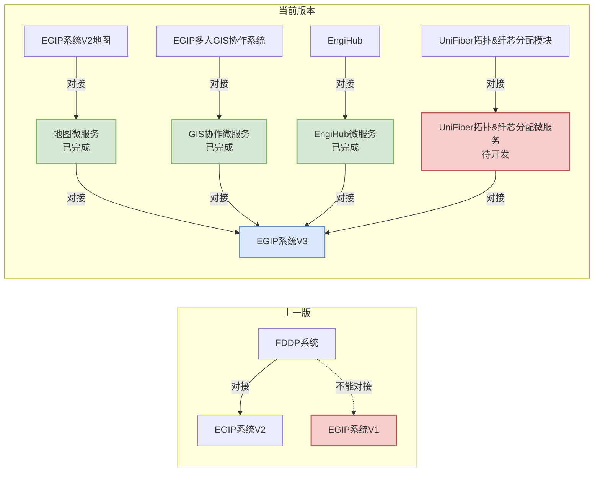
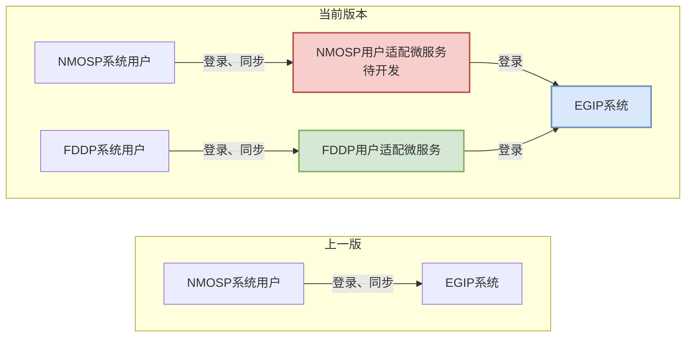
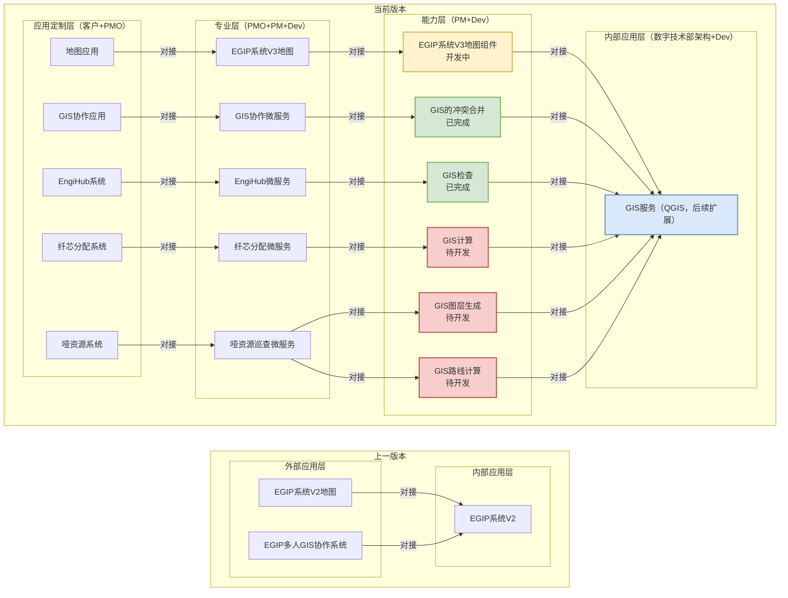

介绍的内容

## 多场景支持

```mermaid
flowchart LR

subgraph Before["上一版"]
    F1["FDDP系统"]
    V2["EGIP系统V2"]
    V1["EGIP系统V1"]

    F1 -->|"对接"| V2
    F1 -.->|"不能对接"| V1
end

subgraph After["当前版本"]
    M1["EGIP系统V2地图"]
    MS1["地图微服务<br/>已完成"]
    V3["EGIP系统V3"]

    M2["EGIP多人GIS协作系统"]
    MS2["GIS协作微服务<br/>已完成"]

    M3["EngiHub"]
    MS3["EngiHub微服务<br/>已完成"]

    M4["UniFiber拓扑&纤芯分配模块"]
    MS4["UniFiber拓扑&纤芯分配微服务<br/>待开发"]

    M1 -->|"对接"| MS1 -->|"对接"| V3
    M2 -->|"对接"| MS2 -->|"对接"| V3
    M3 -->|"对接"| MS3 -->|"对接"| V3
    M4 -->|"对接"| MS4 -->|"对接"| V3
end

style MS1 fill:#D5E8D4,stroke:#82B366,stroke-width:2px
style MS2 fill:#D5E8D4,stroke:#82B366,stroke-width:2px
style MS3 fill:#D5E8D4,stroke:#82B366,stroke-width:2px
style MS4 fill:#F8CECC,stroke:#B85450,stroke-width:2px

style V3 fill:#DAE8FC,stroke:#6C8EBF,stroke-width:2px
style V1 fill:#F8CECC,stroke:#B85450,stroke-width:2px
```

## 多用户支持

```mermaid
flowchart LR

%%================ 上一版 ================
subgraph Before["上一版"]
    direction LR

    U1["NMOSP系统用户"]
    S1["EGIP系统"]

    U1 -->|"登录、同步"| S1
end

%%================ 当前版本 ================
subgraph After["当前版本"]
    direction LR

    N1["NMOSP系统用户"]
    N2["NMOSP用户适配微服务<br/>待开发"]
    E["EGIP系统"]

    F1["FDDP系统用户"]
    F2["FDDP用户适配微服务"]

    N1 -->|"登录、同步"| N2
    N2 -->|"登录"| E

    F1 -->|"登录、同步"| F2
    F2 -->|"登录"| E
end

%%================ 样式 ================
style N2 fill:#F8CECC,stroke:#B85450,stroke-width:2px
style F2 fill:#D5E8D4,stroke:#82B366,stroke-width:2px
style E fill:#DAE8FC,stroke:#6C8EBF,stroke-width:2px
```

## 复杂架构支持-能力和应用分离

```mermaid
flowchart LR

%% ================= 上一版本 =================
subgraph Before["上一版本"]
    direction LR

    subgraph B_EXT["外部应用层"]
        B1["EGIP系统V2地图"]
        B2["EGIP多人GIS协作系统"]
    end

    subgraph B_IN["内部应用层"]
        B3["EGIP系统V2"]
    end

    B1 -->|"对接"| B3
    B2 -->|"对接"| B3
end

%% ================= 当前版本 =================
subgraph After["当前版本"]
    direction LR

    subgraph A_EXT["应用定制层（客户+PMO）"]
        A1["地图应用"]
        A2["GIS协作应用"]
        A3["EngiHub系统"]
        A4["纤芯分配系统"]
        A5["哑资源系统"]
    end

    subgraph A_MS["专业层（PMO+PM+Dev）"]
        M1["EGIP系统V3地图"]
        M2["GIS协作微服务"]
        M3["EngiHub微服务"]
        M4["纤芯分配微服务"]
        M5["哑资源巡查微服务"]
    end

    subgraph A_CAP["能力层（PM+Dev）"]
        C1["EGIP系统V3地图组件<br/>开发中"]
        C2["GIS的冲突合并<br/>已完成"]
        C3["GIS检查<br/>已完成"]
        C4["GIS计算<br/>待开发"]
        C5["GIS图层生成<br/>待开发"]
        C6["GIS路线计算<br/>待开发"]
    end

    subgraph A_IN["内部应用层（数字技术部架构+Dev）"]
        A6["GIS服务（QGIS，后续扩展）"]
    end

    A1 -->|"对接"| M1 -->|"对接"| C1 -->|"对接"| A6
    A2 -->|"对接"| M2 -->|"对接"| C2 -->|"对接"| A6
    A3 -->|"对接"| M3 -->|"对接"| C3 -->|"对接"| A6
    A4 -->|"对接"| M4 -->|"对接"| C4 -->|"对接"| A6

    A5 -->|"对接"| M5
    M5 -->|"对接"| C5 -->|"对接"| A6
    M5 -->|"对接"| C6 -->|"对接"| A6
end

%% ================= 样式 =================
style C2 fill:#D5E8D4,stroke:#82B366,stroke-width:2px
style C3 fill:#D5E8D4,stroke:#82B366,stroke-width:2px

style C1 fill:#FFF2CC,stroke:#D6B656,stroke-width:2px

style C4 fill:#F8CECC,stroke:#B85450,stroke-width:2px
style C5 fill:#F8CECC,stroke:#B85450,stroke-width:2px
style C6 fill:#F8CECC,stroke:#B85450,stroke-width:2px

style A6 fill:#DAE8FC,stroke:#6C8EBF,stroke-width:2px
```

